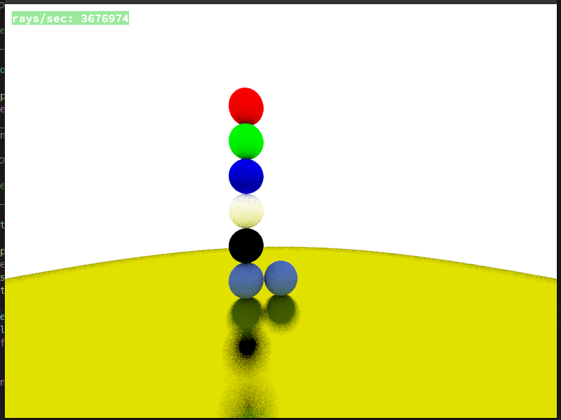
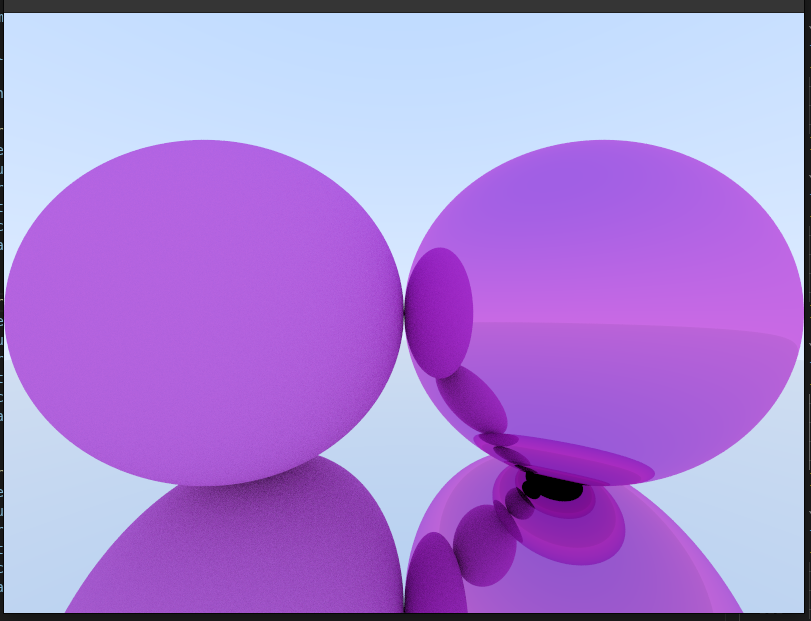

*This project has been created as part of the 42 curriculum by ileon, rgohrig.*

# miniRT — My first RayTracer with MiniLibX

## Description

miniRT is a ray tracer written in C as part of the 42 School curriculum. It renders 3D scenes defined in `.rt` scene files using the ray tracing technique: for each pixel, a ray is cast from the camera into the scene, and the color is determined by intersections with geometric objects, lighting, shadows, and material properties.

**Implemented features:**
- Three geometric primitives: sphere, plane, cylinder (with caps)
- Phong lighting model: ambient, diffuse, and specular components
- Hard shadows
- Reflective materials (mirrors with configurable fuzz)
- Refractive/dielectric materials (glass, water)
- Anti-aliasing (multi-sample per pixel)
- Interactive camera movement and rotation
- Window resize support




---

## Instructions

### Dependencies

- `cc` (C compiler)
- `cmake` (>= 3.18)
- `make`
- `libglfw3-dev` (or equivalent — e.g. `sudo apt install libglfw3-dev` on Debian/Ubuntu)

`libft` and `MLX42` are included as submodules and built automatically.

### Build

```bash
make
```

For a debug build with AddressSanitizer:

```bash
make debug
```

### Run

```bash
./miniRT <scene.rt>
```

Example:

```bash
./miniRT scenes/subject_mini.rt
```

The program exits with `Error\n` followed by a message if the scene file is invalid or missing required elements (camera `C`, ambient light `A`, at least one light `L`).

### Controls

| Key | Action |
|-----|--------|
| `W` / `S` | Move camera forward / backward |
| `A` / `D` | Move camera left / right |
| `Space` / `Left Shift` | Move camera up / down |
| Arrow keys | Rotate camera |
| `ESC` or window close button | Quit |

### Scene File Format (`.rt`)

Each line defines one scene element. Fields are separated by spaces or tabs. Elements can appear in any order. Elements starting with a capital letter (`A`, `C`, `L`) can only be declared once.

| Element | Format | Example |
|---------|--------|---------|
| Ambient light | `A <ratio> <R,G,B>` | `A 0.2 255,255,255` |
| Camera | `C <x,y,z> <dx,dy,dz> <fov>` | `C -50,0,20 0,0,1 70` |
| Light | `L <x,y,z> <brightness> <R,G,B>` | `L -40,0,30 0.7 255,255,255` |
| Sphere | `sp <x,y,z> <diameter> <R,G,B>` | `sp 0,0,20 20 255,0,0` |
| Plane | `pl <x,y,z> <nx,ny,nz> <R,G,B>` | `pl 0,0,0 0,1,0 255,0,225` |
| Cylinder | `cy <x,y,z> <nx,ny,nz> <diameter> <height> <R,G,B>` | `cy 50,0,20 0,0,1 14.2 21.42 10,0,255` |

Minimal scene example:

```
A  0.2              255,255,255
C  -50,0,20  0,0,1  70
L  -40,0,30  0.7    255,255,255

pl  0,0,0    0,1,0  255,0,225
sp  0,0,20   20     255,0,0
cy  50,0,20  0,0,1  14.2  21.42  10,0,255
```

---

## Screenshots




---

## Resources

**MiniLibX / MLX42:**
- [MLX42 GitHub](https://github.com/codam-coding-college/MLX42) — the graphics library used

**AI usage:**
AI was used during this project for the following tasks:
- Explaining mathematical concepts (quadratic formula derivation for cylinder intersection, Phong shading components)
- Reviewing PR comments and checking whether they were technically correct
- Generating boilerplate code (Makefile cleanup, README structure)

All AI-generated code and explanations were reviewed, understood, and verified by the authors before being used.
