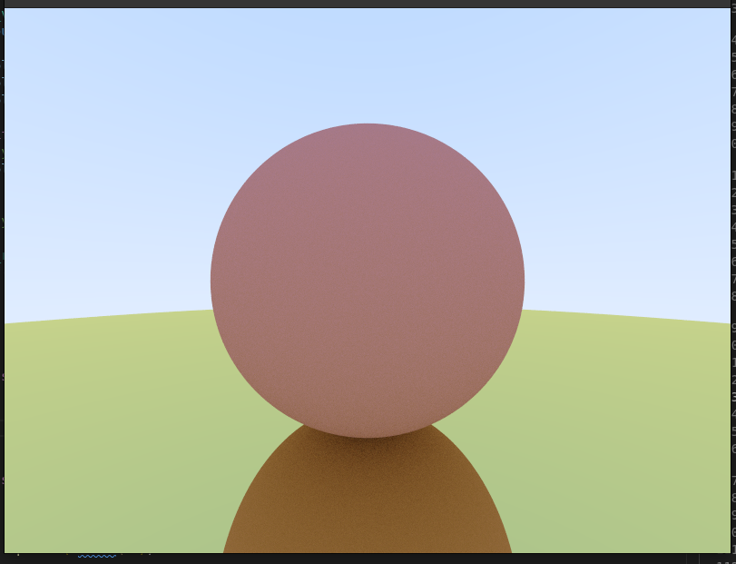
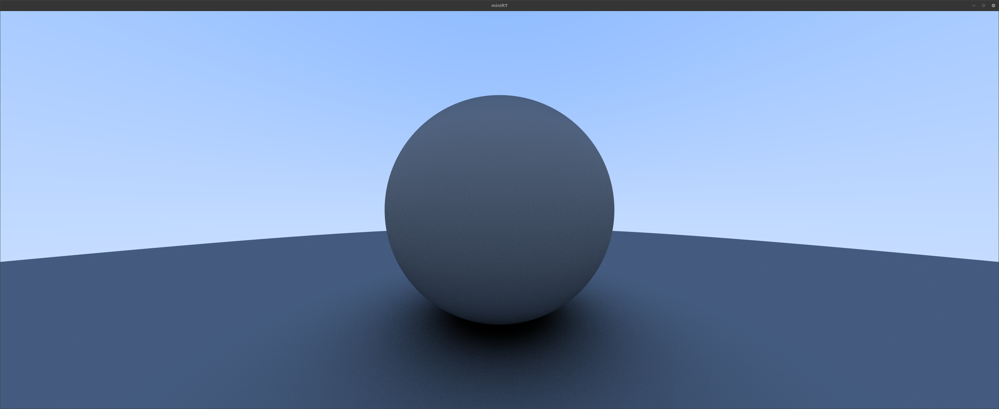
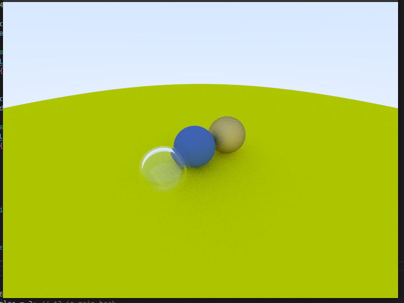

# miniRT

A raytracer written in C as a 42 School project. Renders 3D scenes with spheres, planes, and cylinders using Phong shading, shadows, reflections, and refractions.




## Features

- Phong lighting model (ambient, diffuse, specular)
- Shadows
- Reflective and refractive (glass/dielectric) materials
- Anti-aliasing
- Interactive camera movement
- Scene loading from `.rt` files

## Requirements

- `cc` (C compiler)
- `cmake`
- `make`
- `libglfw3-dev` (or equivalent on your system)
- `libft` (included as submodule)
- `MLX42` (included as submodule or cloned automatically)

## Build

```bash
make
```

For a debug build with address sanitizer:

```bash
make debug
```

## Usage

```bash
./miniRT scenes/subject_mini.rt
```

## Controls

| Key | Action |
|-----|--------|
| `W` / `S` | Move camera forward / backward |
| `A` / `D` | Move camera left / right |
| `Space` / `Left Shift` | Move camera up / down |
| Arrow keys | Rotate camera |
| `ESC` | Quit |

## Scene File Format (`.rt`)

Each line defines one element. Fields are separated by whitespace and tabs.

### Ambient Light
```
A  <intensity>  <R,G,B>
```
```
A  0.2  255,255,255
```

### Camera
```
C  <x,y,z>  <dir_x,dir_y,dir_z>  <fov>
```
```
C  -50,0,20  0,0,1  70
```

### Light
```
L  <x,y,z>  <brightness>  <R,G,B>
```
```
L  -40,0,30  0.7  255,255,255
```

### Sphere
```
sp  <x,y,z>  <diameter>  <R,G,B>
```
```
sp  0,0,20  20  255,0,0
```

### Plane
```
pl  <x,y,z>  <normal_x,normal_y,normal_z>  <R,G,B>
```
```
pl  0,0,0  0,1,0  255,0,225
```

### Cylinder
```
cy  <x,y,z>  <axis_x,axis_y,axis_z>  <diameter>  <height>  <R,G,B>
```
```
cy  50,0,20  0,0,1  14.2  21.42  10,0,255
```

## Screenshots



